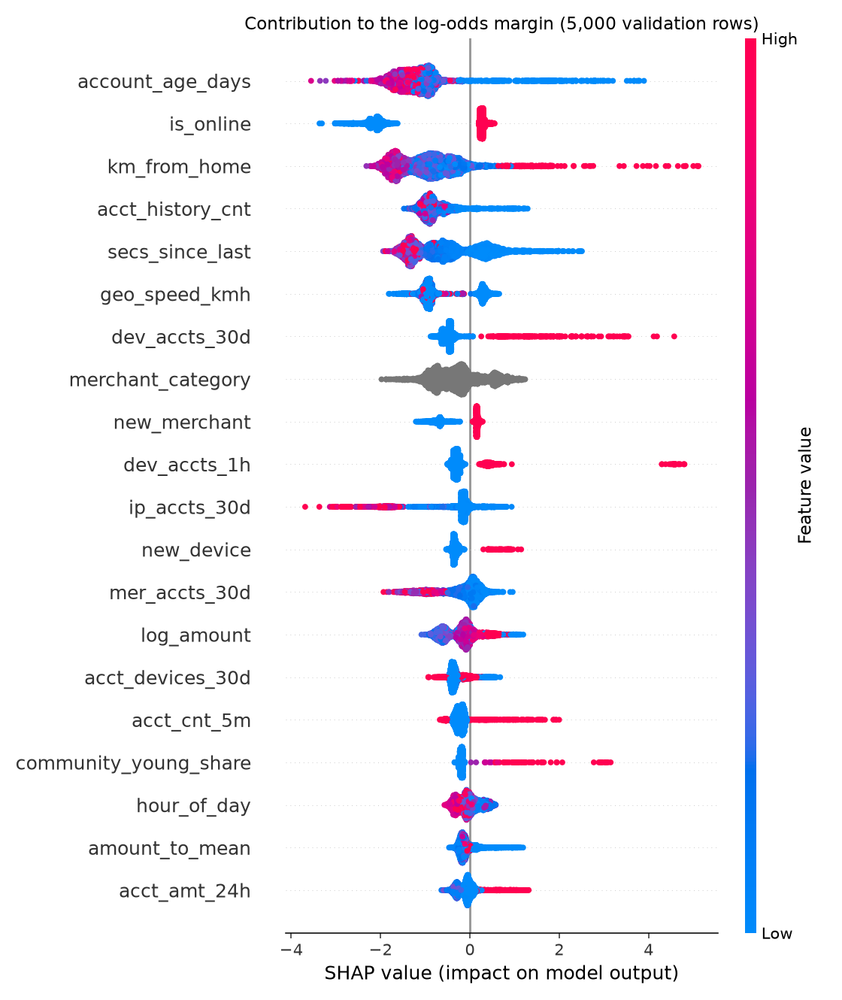

# Results

**Generated by `make results`. Do not edit by hand (PLAN §0.4, §7.9).**

- Model version: `v1` · blend weight `w* = 0.5` · commit `5ba2675`
- Every number traces to a file in `reports/experiments/`.
- One simulated dataset, no confidence intervals. Rows inside one attack are
  correlated, so a row-level bootstrap would overstate certainty (§7.8).

## Validation split

Development split. Thresholds are chosen here, under a 2% alert budget.

| Exp | PR-AUC | Precision | Recall | F1 | FPR | Alert rate | VDR | VEL | ATO | CT | RING |
|---|---|---|---|---|---|---|---|---|---|---|---|
| E1 · rules R1-R4 | 0.4181 | 0.622 | 0.651 | 0.636 | 0.0054 | 1.40% | 0.289 | 0.84 | 0.18 | 0.80 | 0.48 |
| E2 · XGBoost, 30 hot | 0.9973 | 0.947 | 0.988 | 0.967 | 0.0007 | 1.39% | 0.993 | 0.94 | 1.00 | 1.00 | 1.00 |
| E3 · XGBoost, 36 | 0.9973 | 0.946 | 0.986 | 0.966 | 0.0008 | 1.39% | 0.991 | 0.93 | 1.00 | 1.00 | 1.00 |
| E3b · graph only (6) | 0.3114 | 1.000 | 0.296 | 0.456 | 0.0000 | 0.39% | 0.199 | 0.00 | 0.00 | 0.00 | 1.00 |
| E4 · blend at w* | 0.9938 | 0.960 | 0.985 | 0.973 | 0.0005 | 1.37% | 0.988 | 0.92 | 1.00 | 1.00 | 1.00 |

### HOLD tier

**HOLD is disabled in this model version. Every flagged transaction goes to REVIEW** — 909 of them, at 0.960 precision.

§7.7 picks the HOLD threshold as the lowest one reaching 0.95 precision, which assumes precision at the budget threshold sits *below* that bar. Here it does not, so the lowest qualifying threshold is the REVIEW threshold itself and the two tiers coincide. Shipping that would freeze every flagged customer and leave the analyst queue empty, so the tier is switched off and reported as not separating, rather than manufactured by moving the bar.

The measured numbers are kept in `models/*/metadata.json` under `thresholds.valid`, so "HOLD was possible but not distinct" stays distinguishable from "nothing was precise enough". `ALLOW`/`REVIEW`/`HOLD` remains the decision vocabulary; a later model version can enable the tier without a schema change (PLAN §7.7).

## Test split

Read once (§7.11). Thresholds come from the validation split; nothing here
was fitted or tuned on test.

Evaluated once on 2026-09-21T01:59:13+00:00, model `v1`, commit `0d30e50`. Every run appends to `reports/test_runs.log` (§7.11).

| Exp | PR-AUC | Precision | Recall | F1 | FPR | Alert rate | VDR | VEL | ATO | CT | RING |
|---|---|---|---|---|---|---|---|---|---|---|---|
| E1 · rules R1-R4 | 0.4799 | 0.702 | 0.663 | 0.682 | 0.0058 | 1.90% | 0.408 | 0.81 | 0.16 | 0.77 | 0.64 |
| E2 · XGBoost, 30 hot | 0.9982 | 0.960 | 0.993 | 0.976 | 0.0008 | 2.08% | 0.995 | 0.96 | 1.00 | 1.00 | 1.00 |
| E3 · XGBoost, 36 | 0.9983 | 0.953 | 0.994 | 0.973 | 0.0010 | 2.10% | 0.996 | 0.96 | 1.00 | 1.00 | 1.00 |
| E4 · blend at w* | 0.9938 | 0.958 | 0.993 | 0.975 | 0.0009 | 2.09% | 0.996 | 0.97 | 1.00 | 1.00 | 0.99 |

### Alert budget on test

> **The alert rate is 2.09%, above the 2% review budget.** The budget was met on validation (1.37%) and the threshold was carried over unchanged, as §7.11 requires — it was deliberately not re-tuned on test.
>
> The cause is prevalence, not drift. The test window carries 2.01% fraud against validation's 1.34%, 1.51x as much (2,075 fraudulent rows in 102,987). At 99.3% recall the alert count tracks the fraud count almost exactly, so more fraud means more alerts at the same threshold. E2 and E3 overshoot by the same margin, which is what rules this out as something specific to the blend.
>
> In production this is what the budget is for: it would show up as a capacity breach and the threshold would be raised for the next model version, trading recall for load. It is reported here rather than fixed, because re-tuning on test is exactly what §7.11 forbids.

### HOLD tier

**Unchanged from validation: HOLD is disabled.** The tier was switched off when the thresholds were chosen on the validation split, before the test split had been read, and the artifact was not rebuilt afterwards. The test evaluation applied the stored policy and reports `enabled: false, source: "policy"`, with 0 HOLD decisions.

The ordering is verifiable: the commit in `reports/test_runs.log` is the one that already carried the disabled tier, and `models/v1/metadata.json` has one `metrics.test` block written by that run and a `thresholds` block written before it (§7.11, §8).

## E5 · leave-one-pattern-out: does the ensemble earn its place?

Each pattern is withheld from training in turn, so `XGB_-k` has genuinely never
seen it. Recall is measured on the withheld pattern, on the validation split.

| Withheld pattern | Recall on it: `XGB_-k` alone | Recall on it: blended at `w*` | Overall precision: alone → blended |
|---|---|---|---|
| `VELOCITY` | 0.049 | **0.636** | 0.976 → 0.909 |
| `ATO` | 0.092 | **0.701** | 0.996 → 0.939 |
| `CARD_TESTING` | 0.005 | **0.639** | 0.950 → 0.818 |
| `RING` | 0.000 | **0.000** | 0.928 → 0.934 |

Mean overall recall across the four withheld-pattern runs, by blend weight:

| w | 1 | 0.95 | 0.9 | 0.85 | 0.8 | 0.7 | 0.6 | 0.5 |
|---|---|---|---|---|---|---|---|---|
| mean LOPO recall | 0.7396 | 0.7593 | 0.8442 | 0.8406 | 0.8290 | 0.8550 | 0.8499 | 0.8555 |

`w* = 0.5` (argmax, ties to the larger `w`). The grid stops
at 0.5, so a better point below it would not be visible, and the top of the
curve is flat — the margin over `w = 0.7` is about two transactions. What the
curve does support is the step away from `w = 1.0`.

## Global feature importance

Contributions come from the model's own `pred_contribs`, the same numbers
behind the per-alert reason codes (§7.10).
